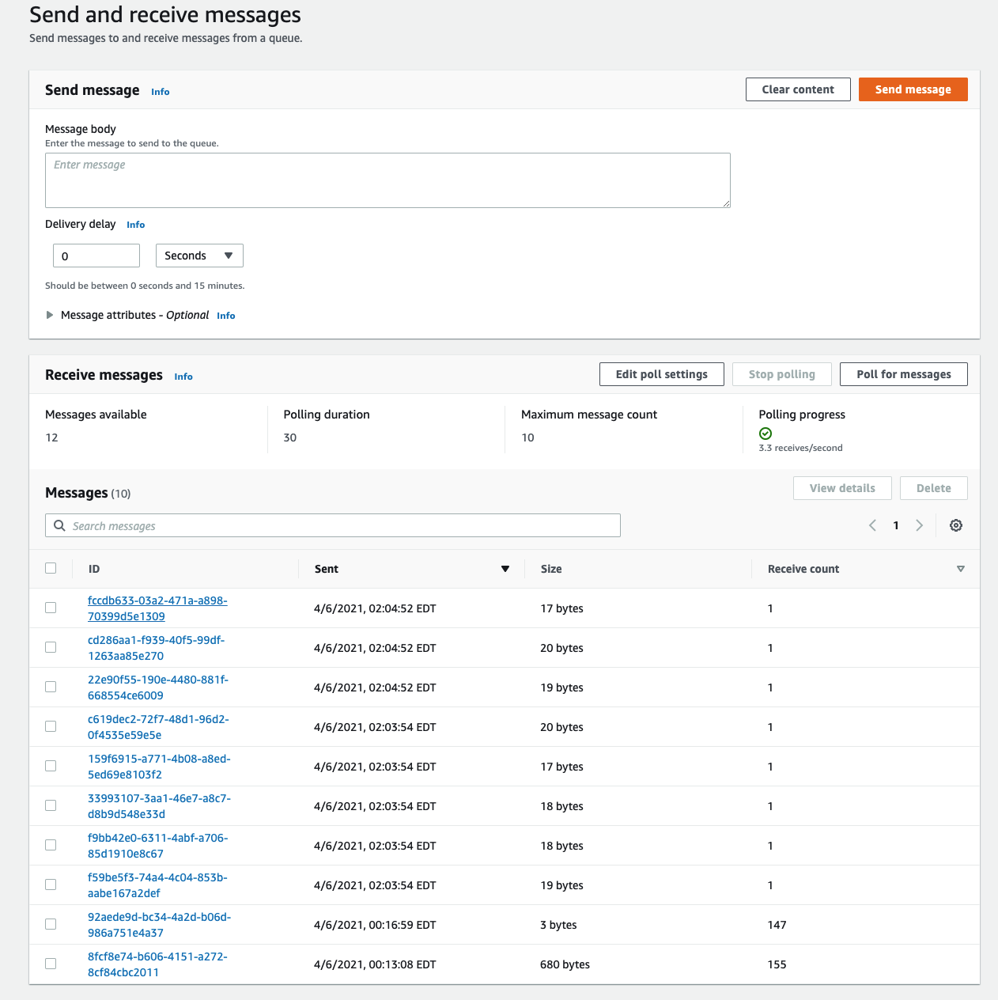
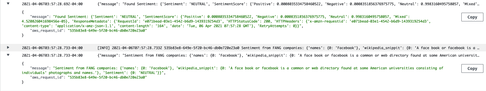

### Build Data Engineering Pipelines with AWS Lambda Step by Step  

#### General Operations in Cloud9

1. **Build Secure Connection between Git and Cloud9**

   Set up SSH keys using `ssh-keygen -t rsa`. 

   Print out the result using `cat directory/fileName.pub`. 

   Use the printed SSH key to establish connection with your github account, through the security settings in your github account. 

   Finally, clone your git repository to Cloud9 environment. 

   Note: The `directory/fileName.pem` is the public key file in the output of the SSH key generation process. And you have to save the printed result. 

2. **Set Up IAM Role for AWS Service**

   Create a IAM role through the IAM web service with Administrator Access to allow AWS Lambda to call other services on your behalf. 

3. **Deploy AWS Lambda Using AWS SAM through Cloud9**

   This is a **very important** step. Typically, here is how to create a AWS SAM Service in Cloud9. In the cloud9 console, type the commands below and follow the instructions at each step according to the output. 

   a. `sam init`

   Choices: AWS Quick Start Templates, Image, python3.7-base 

   b. `sam build`

   c. `sam local build`

   d. `sam deploy --guided`

   e. `sam local invoke`: to test the function. 

   f. `sam local start-api`: to test the api. 

   However, to create a AWS Lambda function, there are typically two ways. 

   1. Create the Lambda Function directly through the AWS Lambda Website, without creating the entire SAM application. In the meantime, you could edit and delete this function in Cloud9 environment at your wish. However, this approach does not allow you to deploy the function easily and directly, especially when the function require external libraries.  

   2. An alternative method is to create a SAM application through Cloud9 IDE and deploy it as an AWS Lambda application with customized functions by default. To do this you have to follow the steps below. 

      1.  Go to the AWS ToolKit (AWS Explorer) on the left tool bar, and then right click on Lambda to create a SAM application. Choose the configuration you like and then SAM application is created.  

         A typical setup is: basic hello world template, python 3.7. 

      2. Then, you need to edit the code of the created SAM appliation in the Cloud9 environment under proper directroies with the customized name. While you update the code that is necessary for your Lambda functions, you have to update the `requirements.txt`, which is quite crucial in the success of the deployment. 

         **Remark:** For this project, it has to be python3.7 to run the code successfully.  

      3. After you complete editing the functions, use the `sam build --use-container` command to build the application, and use `sam deploy --guided` to deploy the application to the cloud. Finally, you could find this application in the AWS Lambda Applications. 

      4. Set up the triggers that are necessary for the pipeline through the AWS Lambda Website. 

   

#### Build the Pipeline 

1. Create a table using DynamoDB, which could scale automatically. It stores all the data to be analyzed sentimentally. The data in this table will be pull by the producer Lambda function. 

   This table should be called "fang1" according to the code, which should be consistent with the name for the DynamoDB table in the consumer function code. 

2. Write the producer Lamda function through the Cloud9 IDE, and deploy it to the cloud. The code for `producer` function is shown in the repo. The method to create the lambda function is shown above. A CloudWatch Timer serves as a trigger and calls this function at a rate of once per minute. And this functions pulls the data from a `DynamoDB` table and send it to a simple queue created by the AWS Simple Queue Service. 

3. Create a Simple Queue Service called "producer" through the AWS management console. Its function is to receive data from the producer Lambda function and send data to the consumer Lambda function as a trigger. The name of this SQS is very important. It must be consistent with the name in the producer code, which is "producer" in this case. 

   Here is a picture of the queue receiving data from the producer function. 
   
   

   By this step, we have already set up the CloudWatch Timer, Producer Lambda Function, DynamoDB database, and Simple Queue Service. Next, we will build the consumer lambda function. 

4. Write the consumer Lamda function through the Cloud9 IDE, and deploy it to the cloud. The code for `producer` function is shown in the repo. The method to create the lambda function is shown above. 

   This function receives the data send by the simple queue, and analyze the sentiment of the data received from the simple queue through AWS Comprehend. Finally, it writes the sentiment analysis result into a csv file and store the result in a S3 bucket. 

   

   I did not manage to write the csv files to the S3 bucket, but I have obtained the sentiment result from the sentiment analysis in the consumer lambda function. A sample result is shown above, captured from the log of the consumer function. 

#### Conclusion and Further Improvement 

1. Using AWS Lambda, Cloud9 IDE, SQS, Comprehend, IAM,  CloudWatch Timer, and DynamoDB database, I have successfully constructed a data engineering pipeline that controls the production of data, transmission of the data, and sentiment analysis of the data, but failed to store the data properly in the S3 bucket. The issue has been found to be the malfunctioning of the function `s3_resource = botos.resource("s3")` through the log information of the consumer function. Further debugging work will focus on this part. 

2. Essential points to run the code successfully: **Python version** must be set to 3.7. Create a virtual environment in Cloud9 IDE to avoid various potential issues like permission issues and python package installation issues. The **virtual environment** could be established using the following commands: 

   1. Create the virtual environment: python3 -m venv ~/.venv`.
   2. Activate the virtual environment: `source ~/.venv/bin/activate`
   3. Deactivate the virtual environment: `deactivate` 

   Finally, **Log information** is very helpful in determining the bugs in the code. 
